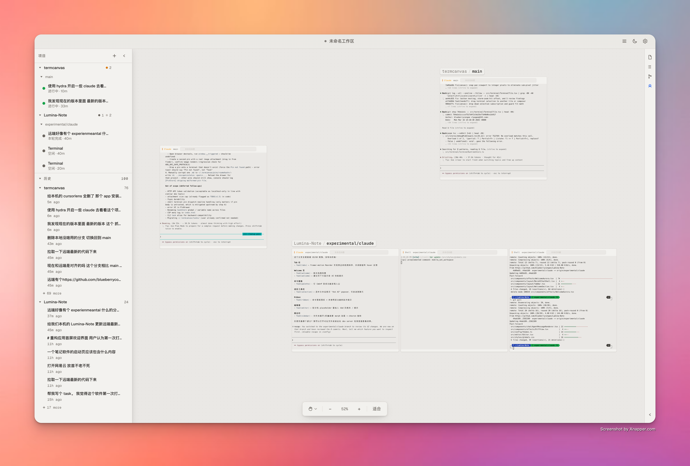
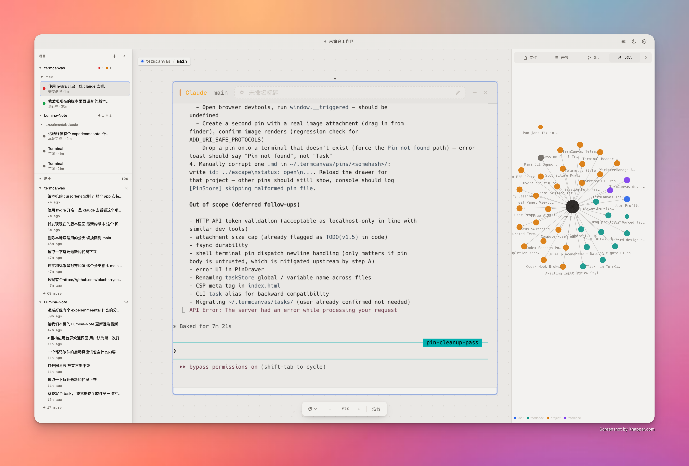
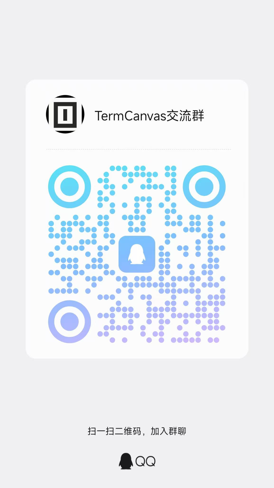

<div align="center">


# TermCanvas

**Your terminals, on an infinite canvas.**

[](https://github.com/blueberrycongee/termcanvas/releases)
[](LICENSE)
[]()
[](https://website-ten-mu-37.vercel.app)

[**termcanvas.dev →**](https://website-ten-mu-37.vercel.app)

<br>


<br>



<br><br>



</div>

<br>

TermCanvas spreads all your terminals across an infinite spatial canvas — no more tabs, no more split panes. Drag them around, zoom in to focus, zoom out to see the big picture.

It organizes everything in a **Project → Worktree → Terminal** hierarchy that mirrors how you actually use git. Add a project, and TermCanvas auto-detects its worktrees. Create a new worktree from the terminal, and it appears on the canvas instantly.

<p align="right"><a href="./README.zh-CN.md">中文文档 →</a></p>

> **New to TermCanvas?** Read the full [**User Guide**](./docs/user-guide.md) — every interaction explained, every keyboard shortcut, plus the non-obvious tricks (⌘E focus chain, drag-to-stash, session replay, etc.).

---

## Quick Start

**Download** — grab the latest build from [GitHub Releases](https://github.com/blueberrycongee/termcanvas/releases).

> [!IMPORTANT]
> **Apple Silicon (M-series) Macs — pick the file with `arm64` in its name**
> Files **with** `arm64` in the filename (e.g. `TermCanvas-X.Y.Z-arm64.dmg`, `TermCanvas-X.Y.Z-arm64-mac.zip`) are native Apple Silicon builds. Files **without** `arm64` are Intel (x64) builds — they'll still launch on M-series Macs via Rosetta 2, but you'll see noticeable lag when panning/zooming the canvas.
>
> To verify after install: open **Activity Monitor**, find TermCanvas, and check the **Kind** column — it should say **Apple**, not **Intel**. If it says Intel, delete the app and redownload the `arm64` variant.

> [!WARNING]
> **macOS note for unsigned builds**
> If macOS says TermCanvas is damaged or blocks launch because the app is unsigned, clear the quarantine attribute and try again:
>
> ```bash
> xattr -cr /Applications/TermCanvas.app
> ```
>
> If you installed the app somewhere else, replace the path with the actual app location.

**Build from source:**

This workspace uses `pnpm`, and `pnpm-lock.yaml` is the canonical lockfile.

```bash
git clone https://github.com/blueberrycongee/termcanvas.git
cd termcanvas
pnpm install
pnpm dev
```

**Install CLI tools** — after launching the app, go to Settings → General → Command line interface and click Register. This adds `termcanvas` and `hydra` to your PATH.

---

## Features

### Canvas

Infinite canvas — pan, zoom, and arrange terminals freely. Three-layer hierarchy: projects contain worktrees, worktrees contain terminals. New worktrees appear automatically as you create them.

Double-click a terminal title bar to zoom-to-fit. Drag to reorder. Box-select multiple terminals. Draw and annotate freely on the canvas itself with the Free Canvas tool — sketches, callouts, and grouping lines live alongside your terminals. Save your entire layout to a `.termcanvas` file.

### AI Coding Agents

First-class support for **Claude Code**, **Codex**, **Kimi**, **Gemini**, and **OpenCode**.

- **Glance at any tile to know what it's doing** — a coloured status dot tells you whether the agent is thinking, awaiting input, idle, or done
- **Pick up where you left off** — close and reopen an agent terminal without losing the conversation
- **Review changes in place** — inline diff cards let you read an agent's edits without leaving the canvas

### Sessions Panel

Every past Claude / Codex conversation in your projects, organised as projects → worktrees → sessions. Click any row to replay it, or jump straight to the running terminal. Worktrees show their live git status so you can tell at a glance what's clean.

### Git

Commit history, diff viewer, and live git status — built into the sidebar so you never need to leave the canvas to check what changed.

### Terminals

Shell, lazygit, and tmux terminals live alongside AI agents on the same canvas. Star the ones you keep coming back to (<kbd>⌘</kbd><kbd>F</kbd>) and cycle through just those with <kbd>⌘</kbd><kbd>]</kbd> / <kbd>⌘</kbd><kbd>[</kbd> — use <kbd>⌘</kbd><kbd>G</kbd> to choose whether you're cycling all terminals, just starred, or whole worktrees. Custom titles, per-agent CLI override, and your preferred terminal size is remembered after the first manual resize.

### Usage Tracking

Track how much you're spending on Claude and Codex — across all projects, broken down by model, with quota meters for the 5-hour and 7-day rate limits. Sign in to keep usage in sync across devices.

### Settings

Downloadable monospace fonts · dark / light theme · rebindable keyboard shortcuts · adjustable contrast for accessibility · English and Chinese · in-app auto-update.

---

## CLI

Both CLIs are bundled with the app. Register them from Settings to use in any terminal.

### termcanvas

<details>
<summary>Full command reference</summary>

```
Usage: termcanvas <group> <command> [args]

Groups:
  project        add | list | remove | rescan
  worktree       list | create | remove
  terminal       create | list | status | output | destroy | set-title
  workflow       Lead-driven Hydra workflow over HTTP (init / dispatch / watch …)
  telemetry      get | events
  computer-use   status | enable | setup | disable | stop | list-apps
                 | open-app | get-app-state | click | type | press-key | scroll | drag
  pin            add | list | show | update | rm
  diff           <worktree-path> [--summary]
  state          dump full canvas state as JSON

Common shapes:
  project add <path>
  worktree create --repo <path> --branch <name> [--from <ref>]
  terminal create --worktree <path> --type <claude|codex|shell|…>
          [--prompt <text>] [--parent-terminal <id>] [--auto-approve]
  terminal output <id> [--lines N]              # default 50
  telemetry get --terminal <id>
  telemetry get --workflow <id> --repo <path>
  pin add --title <t> [--body <b>] [--link <url>] [--link-type <type>]

Flags:
  --json    Machine-readable output for any command
```

</details>

```bash
termcanvas project add ~/my-repo
termcanvas terminal create --worktree ~/my-repo --type claude --prompt "Audit the auth flow and fix the root cause"
termcanvas terminal status <id>
termcanvas telemetry get --terminal <id>
termcanvas diff ~/my-repo --summary
```

For Claude/Codex task automation, start a fresh terminal with `termcanvas terminal create --prompt "..."`. `termcanvas terminal input` is not a supported dispatch path.

<br>

<div align="center">


### hydra
</div>

<br>

Hydra is TermCanvas's terminal orchestration toolkit for Lead-driven workflows and isolated direct workers. It coordinates **git worktrees**, **assignment/run file contracts**, and the **telemetry truth layer** without taking control away from the agent sessions themselves.

Hydra is now **Lead-driven**. One main terminal owns the workbench, reads the codebase, and decides what to do at each decision point. Worker terminals stay autonomous. Workbench state lives under repo-local `.hydra/workbenches/`, and the authoritative contract is on disk: `inputs/intent.md`, `dispatches/<dispatchId>/intent.md`, `report.md`, `result.json`, and `ledger.jsonl`. Terminal prose is advisory only; validated `result.json` is the machine gate.

Role-driven workflows currently target **Claude/Codex** through the Hydra role registry. If you only need one isolated worker without a Lead-driven DAG, use `hydra spawn` instead.

This design is inspired by [Anthropic's harness design research](https://www.anthropic.com/engineering/harness-design-long-running-apps) on long-running agent orchestration, adapted for terminal-based agents where each process is naturally isolated. For the theoretical foundations behind this approach, see [Harness Design from a Distribution Perspective](harness-design-essay.md).

#### Getting started

Run `hydra init-repo` in your project (or click **Enable Hydra** in the worktree header) to sync the Hydra instructions into `CLAUDE.md` / `AGENTS.md`. Then either talk to your main agent, or drive the workflow yourself:

> *Write a PRD or describe your requirements clearly, then tell the agent:*
>
> *"Read the Hydra skill. I want you to choose the right mode and autonomously complete this task based on the PRD in `docs/prd/auth-redesign.md`."*

The main agent should classify the task and pick the lightest fitting path:

- **Stay in current agent** — simple or local tasks, no orchestration overhead
- **`hydra spawn`** — a direct isolated worker when the task is clear and self-contained
- **`hydra init` + `dispatch` + `watch`** — Lead-driven workflow for ambiguous, risky, parallel, or multi-step work

```bash
hydra init-repo

hydra init --intent "Add OAuth login" --repo .

hydra dispatch --workbench <id> --dispatch dev --role dev \
  --intent "Implement OAuth login and the tests that cover it" --repo .

hydra watch --workbench <id> --repo .

hydra dispatch --workbench <id> --dispatch review --role reviewer \
  --intent "Independent review of the OAuth change" \
  --depends-on dev --repo .

hydra watch --workbench <id> --repo .
hydra complete --workbench <id> --repo .
```

Role files choose the CLI / model / reasoning profile. The caller chooses the `role`; Hydra resolves the terminal from that role definition.

<details>
<summary>Full command reference</summary>

```
Usage: hydra <command> [options]

Lead-driven workbench:
  init        Create a workbench context
  dispatch    Dispatch a unit of work into a workbench
  watch       Wait until a decision point is reached
  redispatch  Re-run an eligible/reset dispatch
  approve     Mark a dispatch output as approved
  reset       Reset a dispatch (and downstream by default) for rework
  ask         Ask a completed dispatch a follow-up question via session resume
  merge       Merge completed parallel dispatch branches
  complete    Mark a workbench as completed
  fail        Mark a workbench as failed

Inspection:
  status      Show structured workbench + assignment state
  ledger      Show workbench event log
  list        List direct spawned agents (pass --workbenches for workbenches)
  list-roles  Show available role definitions

Housekeeping:
  spawn      Create one direct isolated worker terminal
  cleanup    Clean up workbench state or direct spawned workers
  init-repo  Sync Hydra instructions into CLAUDE.md and AGENTS.md
```

</details>

<details>
<summary>Example commands</summary>

```bash
# Repo setup
hydra init-repo

# Start a Lead-driven workbench
hydra init --intent "fix the login bug" --repo .

# Dispatch a unit of work and wait for the decision point
hydra dispatch --workbench <id> --dispatch dev --role dev \
  --intent "Fix the login bug and add regression coverage" --repo .
hydra watch --workbench <id> --repo .

# Ask a completed dispatch a follow-up question without re-running it
hydra ask --workbench <id> --dispatch dev \
  --message "Why did you change the session validation path?" --repo .

# Send a dispatch back for rework
hydra reset --workbench <id> --dispatch dev \
  --feedback "The fix regressed the refresh-token path. Rework it." --repo .
hydra redispatch --workbench <id> --dispatch dev --repo .

# Direct isolated worker
hydra spawn --task "investigate the flaky CI failure" --repo .

# Inspection
hydra status --workbench <id> --repo .
hydra ledger --workbench <id> --repo .
hydra list --workbenches --repo .
hydra list-roles --repo .

# Cleanup
hydra cleanup --workbench <id> --repo . --force
hydra cleanup <agent-id> --force
```

</details>

Lead-driven workbenches advance through validated `result.json` evidence inside `.hydra/workbenches/`. The telemetry truth layer provides real-time `turn_state`, `last_meaningful_progress_at`, `derived_status`, and session attachment data — used by both the UI and Hydra's watch / retry / health-check paths.

**Typical workflow:** write a PRD → run `hydra init-repo` once → let the Lead choose direct work vs `spawn` vs `init/dispatch/watch` → monitor via `hydra watch` or the canvas UI → read `report.md` before approving / resetting / completing. See [Hydra Orchestration Guide](docs/hydra-orchestration.md) for the control-plane details, and the [Hydra Panoramic Flowchart](docs/hydra-panorama-flow.md) for the updated state / file model.

---

## Find your way around

A short map of where each major feature lives. Every shortcut here is rebindable in **Settings → Shortcuts** (Windows/Linux uses <kbd>Alt</kbd> in place of <kbd>⌘</kbd>).

**Discovery — when you don't know where something is**

| Shortcut | Surface | What it's for |
|---|---|---|
| <kbd>⌘</kbd><kbd>P</kbd> | Command Palette | Run any in-app action by name (toggle a panel, open settings, switch theme, etc.) |
| <kbd>⌘</kbd><kbd>K</kbd> | Global Search | Files, terminals, sessions, git branches/commits, memory — fuzzy across the canvas |
| <kbd>⌘</kbd><kbd>⇧</kbd><kbd>J</kbd> | Hub | Right-anchored command center: live terminals, recent activity, waypoints, pinned items |
| <kbd>⌘</kbd><kbd>⇧</kbd><kbd>/</kbd> | Status Digest | Quiet floating chip with the 3–5 most relevant signals across the canvas |

**Canvas navigation**

| Shortcut | Action |
|---|---|
| <kbd>⌘</kbd><kbd>E</kbd> | Toggle focus — zoom into focused terminal / out to fit |
| <kbd>⌘</kbd><kbd>0</kbd> · <kbd>⌘</kbd><kbd>1</kbd> · <kbd>⌘</kbd><kbd>=</kbd> · <kbd>⌘</kbd><kbd>-</kbd> | Zoom: fit · 100% · in · out |
| <kbd>⌘</kbd><kbd>]</kbd> / <kbd>⌘</kbd><kbd>[</kbd> | Next / previous terminal (or worktree / starred — see <kbd>⌘</kbd><kbd>G</kbd>) |
| <kbd>⌘</kbd><kbd>G</kbd> | Cycle focus level (terminal → worktree → starred) |
| <kbd>⌘</kbd><kbd>F</kbd> | Star / unstar the focused terminal |
| <kbd>⌘</kbd><kbd>⇧</kbd><kbd>1</kbd>–<kbd>9</kbd> · <kbd>⌥</kbd><kbd>1</kbd>–<kbd>9</kbd> | Save / recall a spatial waypoint (per project, 9 slots) |
| <kbd>⌥</kbd><kbd>\`</kbd> | Pan to whichever terminal had output most recently (cycles on rapid re-press) |
| <kbd>V</kbd> · <kbd>H</kbd> · <kbd>Space</kbd>(hold) | Select tool · Hand tool · Temporary pan |

**Multi-canvas**

| Shortcut | Action |
|---|---|
| <kbd>⌘</kbd><kbd>⇧</kbd><kbd>]</kbd> / <kbd>⌘</kbd><kbd>⇧</kbd><kbd>[</kbd> | Next / previous canvas (each canvas owns its viewport, projects, waypoints) |
| <kbd>⌘</kbd><kbd>⇧</kbd><kbd>N</kbd> | Open Canvas Manager (rename, reorder, switch) |

**Terminals**

| Shortcut | Action |
|---|---|
| <kbd>⌘</kbd><kbd>T</kbd> · <kbd>⌘</kbd><kbd>D</kbd> | New / close terminal in the focused worktree |
| <kbd>⌘</kbd><kbd>;</kbd> | Open composer (or inline-rename the focused terminal title) |

**Panels & overlays**

| Shortcut | Action |
|---|---|
| <kbd>⌘</kbd><kbd>/</kbd> | Toggle right panel (Files / Diff / Git / Memory) |
| <kbd>⌘</kbd><kbd>⇧</kbd><kbd>U</kbd> | Usage dashboard (cost & quotas) |
| <kbd>⌘</kbd><kbd>⇧</kbd><kbd>H</kbd> | Sessions overlay |
| <kbd>⌘</kbd><kbd>⇧</kbd><kbd>T</kbd> | Snapshot history (browse and restore canvas states, with diff) |
| <kbd>⌘</kbd><kbd>⇧</kbd><kbd>A</kbd> | Activity heatmap on the canvas |

**Workspace**

| Shortcut | Action |
|---|---|
| <kbd>⌘</kbd><kbd>O</kbd> | Add project |
| <kbd>⌘</kbd><kbd>S</kbd> · <kbd>⌘</kbd><kbd>⇧</kbd><kbd>S</kbd> | Save / save-as a `.termcanvas` workspace file |
| <kbd>⌘</kbd><kbd>,</kbd> | Settings |

---

<table>
<tr><td><b>Desktop</b></td><td>Electron</td></tr>
<tr><td><b>Frontend</b></td><td>React · TypeScript</td></tr>
<tr><td><b>Terminal</b></td><td>xterm.js (WebGL) · node-pty</td></tr>
<tr><td><b>State</b></td><td>Zustand</td></tr>
<tr><td><b>Styling</b></td><td>Tailwind CSS · Geist</td></tr>
<tr><td><b>Auth & sync</b></td><td>Supabase</td></tr>
<tr><td><b>Build</b></td><td>Vite · esbuild</td></tr>
</table>

<br>

**Acknowledgements** — [lazygit](https://github.com/jesseduffield/lazygit) is integrated as a built-in terminal type for visual git management on the canvas.

---

## Roadmap

TermCanvas is evolving from a local desktop tool into a **cloud-native AI development platform**. Here's what's coming:

### Cloud Runtime

Move task execution from your local machine to the cloud. Spin up AI agents on remote runtimes — your tasks run in managed environments with full git, toolchain, and dependency support, while your canvas remains the single pane of glass.

- **Hosted agent execution** — delegate Claude, Codex, and other agent tasks to cloud workers with on-demand compute
- **Persistent remote sessions** — close your laptop, come back later, your agents are still working
- **Parallel cloud workers** — scale out Hydra workflows across multiple cloud instances instead of local terminals

### Automated Vibe Pipeline

End-to-end automation from idea to shipped code, powered by cloud runtime:

- **Intent → Plan → Implement → Review → Merge** — a fully automated pipeline where you describe what you want and the system handles the rest
- **Continuous vibe loop** — agents plan, implement, self-review, and iterate autonomously until the result meets acceptance criteria
- **Pipeline-as-code** — define reusable workflow templates for common tasks (bug triage, feature implementation, migration, refactoring)
- **Human-in-the-loop checkpoints** — configurable approval gates at any stage for when you want to stay in control

### Vision

The goal is simple: **you describe intent, TermCanvas handles the rest.** Your canvas becomes a mission control for autonomous AI development — monitor progress, review results, intervene when needed, and let the cloud do the heavy lifting.

---

**Contributing** — fork, branch, and open a PR. Licensed under [MIT](LICENSE).

<div align="center">



[](https://star-history.com/#blueberrycongee/termcanvas&Date)

</div>
