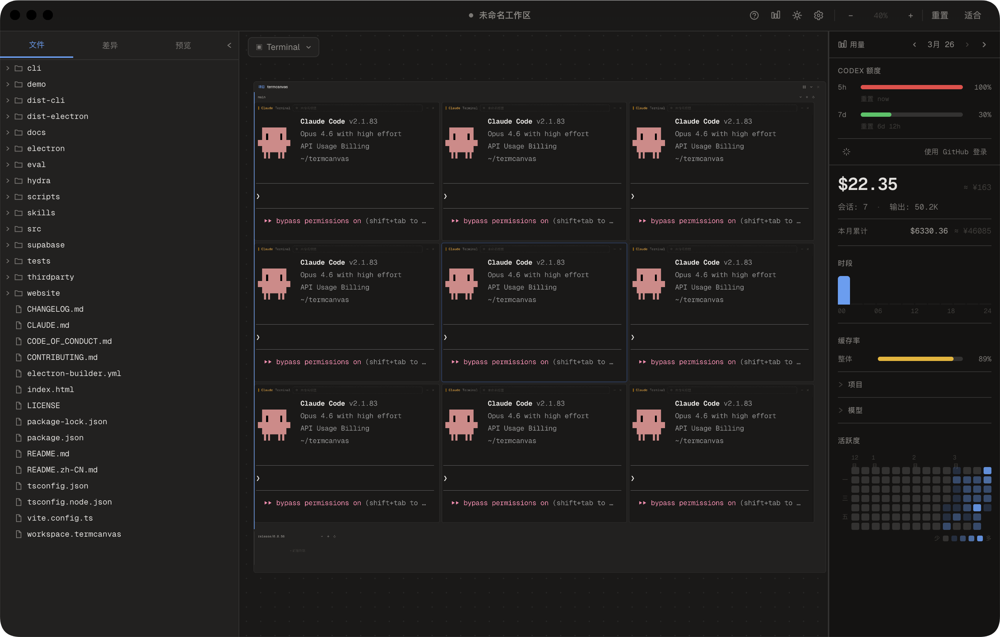

<div align="center">


# TermCanvas

**你的终端，铺在无限画布上。**

[](https://github.com/blueberrycongee/termcanvas/releases)
[](LICENSE)
[]()
[](https://website-ten-mu-37.vercel.app)

<br>


<br>



</div>

<br>

TermCanvas 把你所有的终端铺在一张无限空间画布上——不再有标签页，不再有分屏。自由拖拽、放大聚焦、缩小俯瞰。

它以 **Project → Worktree → Terminal** 三层结构来组织一切，和你使用 git 的方式完全一致。添加一个项目，TermCanvas 自动检测它的 worktree；在终端里新建一个 worktree，画布上立刻出现。

<p align="right"><a href="./README.md">English →</a></p>

> **第一次用 TermCanvas?** 先读完整的[**用户指南**](./docs/user-guide.zh.md) —— 每个交互都讲清楚、每个快捷键都列出来,加上那些不告诉你就永远发现不了的小细节(⌘E 聚焦连环、拖到 stash、会话回放等等)。

---

## 快速开始

**下载** —— 从 [GitHub Releases](https://github.com/blueberrycongee/termcanvas/releases) 获取最新构建。

> [!WARNING]
> **macOS 未签名应用提示**
> 如果 macOS 提示 TermCanvas“已损坏”，或因为应用未签名而阻止启动，先清除 quarantine 属性再重试：
>
> ```bash
> xattr -cr /Applications/TermCanvas.app
> ```
>
> 如果你把应用装在别的位置，把上面的路径改成实际的 `.app` 路径即可。

**从源码构建：**

```bash
git clone https://github.com/blueberrycongee/termcanvas.git
cd termcanvas
npm install
npm run dev
```

**安装命令行工具** —— 启动应用后，进入 设置 → 通用 → 命令行工具，点击注册。这会将 `termcanvas` 和 `hydra` 添加到你的 PATH。

---

## 功能特性

### 画布

无限画布——自由平移、缩放、排列终端。三层层级：项目包含 worktree，worktree 包含终端。新建 worktree 时自动出现在画布上。

双击终端标题栏缩放适配。拖拽排序。框选多个终端。用 Free Canvas 工具直接在画布上手绘和标注——草图、批注、分组线与终端同屏共存。将完整布局保存为 `.termcanvas` 文件。

### AI 编程 Agent

原生支持 **Claude Code**、**Codex**、**Kimi**、**Gemini**、**OpenCode**。

- **实时状态与完成闪光** —— 一眼看到 agent 正在工作、等待还是已完成
- **事件驱动 telemetry** —— Claude Code 和 Codex 通过 lifecycle hooks 直接推送 `awaiting_input`、工具活动、turn 状态，状态翻转即时生效，不再受轮询延迟拖累
- **Telemetry 真相层** —— turn 状态、工具活动、卡顿检测、状态徽章、结构化快照，同时服务 UI 和 Hydra
- **会话恢复** —— 关闭并重新打开 agent 终端，不丢失上下文
- **内联 diff 卡片** —— 不离开画布就能审查 agent 的代码变更

### 桌宠

可选的水豚桌宠，会根据 telemetry 实时反馈 agent 状态：工作中、等待、卡住、停滞、完成、泡澡等。数据来源和状态徽章一致，因此反应一样准。配有走路扬尘、爱心粒子、地面阴影和多种闲置表情，让长时间跑 agent 的陪伴感更好一点。

### 会话面板

会话面板以树形呈现：项目 → worktree → agent 会话。项目整体可折叠展开，点击即可跳到对应终端、查看 session 元数据、基于 session 继续追问。worktree 节点带 git 状态徽章，实时反映文件树状态。

### Git

左侧栏内置 Git 面板——commit 历史、diff 查看器、git 状态一目了然，无需离开画布。

### 终端

Shell、lazygit、tmux 与 AI agent 共存于同一画布。星标重要终端，用 <kbd>⌘</kbd> <kbd>J</kbd> / <kbd>K</kbd> 快速切换。四种尺寸预设、自定义标题、逐 agent CLI 路径覆盖。新建终端会保持你的偏好尺寸——第一次手动调整后即固定为默认，后续「+ Terminal」均沿用，与侧边栏状态无关。

### 用量追踪

Token 用量与成本看板——总花费、按项目和按模型分布。每小时 token 热力图、24 小时成本趋势图、缓存命中率。5 小时与 7 天速率限制配额监控。登录后跨设备同步用量。

### 设置

6 款可下载等宽字体 · 深色/浅色主题 · 自定义键盘快捷键 · 最小对比度无障碍设置 · 中英文自动检测 · 应用内自动更新与更新日志。

---

## 命令行工具

两个 CLI 都随应用打包。在设置中注册后即可在任意终端使用。

### termcanvas

<details>
<summary>完整命令参考</summary>

```
用法: termcanvas <project|terminal|diff|state> <command> [args]

Usage: termcanvas <project|terminal|telemetry|diff|state> <command> [args]

项目命令:
  project add <path>                          添加项目到画布
  project list                                列出所有项目
  project remove <id>                         移除项目
  project rescan <id>                         重新扫描项目的 worktree

终端命令:
  terminal create --worktree <path> --type <type>   创建终端
          [--prompt <text>] [--parent-terminal <id>] [--auto-approve]
  terminal list [--worktree <path>]            列出终端
  terminal status <id>                         获取终端状态
  terminal output <id> [--lines N]             读取终端输出（默认 50 行）
  terminal destroy <id>                        销毁终端

Telemetry 命令:
  telemetry get --terminal <id>                获取终端 telemetry 快照
  telemetry get --workflow <id> [--repo <p>]   获取 workflow telemetry 快照
  telemetry events --terminal <id>             列出最近的终端 telemetry 事件

其他命令:
  diff <worktree-path> [--summary]             查看 worktree 的 git diff
  state                                        导出完整画布状态为 JSON

标志:
  --json    以 JSON 格式输出
```

</details>

```bash
termcanvas project add ~/my-repo
termcanvas terminal create --worktree ~/my-repo --type claude
termcanvas terminal status <id>
termcanvas telemetry get --terminal <id>
termcanvas diff ~/my-repo --summary
```

<br>

<div align="center">


### hydra
</div>

<br>

Hydra 是 TermCanvas 的终端编排工具，用于 Lead 驱动 workflow 和直接隔离 worker。它负责协调 **git worktree**、**assignment/run 文件契约** 以及 **telemetry 真相层**，但不会接管 agent 会话本身。

Hydra 现在是 **Lead 驱动** 的。一个主终端负责读代码、做决策、推进 workbench；worker 终端保持自治。Workbench 状态保存在仓库内的 `.hydra/workbenches/` 目录下，权威契约也都在磁盘上：`inputs/intent.md`、`dispatches/<dispatchId>/intent.md`、`report.md`、`result.json`、`ledger.jsonl`。终端输出只作参考；经过验证的 `result.json` 才是机器门禁。

基于 role 的 workflow 目前主要面向 **Claude/Codex**。如果你只需要一个隔离 worker，而不需要 Lead 驱动的 DAG，就用 `hydra spawn`。

这一设计受到 [Anthropic 关于长时间运行 agent 编排的 harness 设计研究](https://www.anthropic.com/engineering/harness-design-long-running-apps)的启发，并针对终端 agent（每个进程天然隔离）做了适配。关于这一设计背后的理论基础，参见[从数据分布视角看 Harness 设计](harness-design-essay.md)。

#### 开始使用

在项目中运行 `hydra init-repo`（或在 worktree 标题栏点击**启用 Hydra**），把 Hydra 指令同步到 `CLAUDE.md` / `AGENTS.md`。之后你可以直接和主 agent 对话，或者自己驱动 workflow：

> *先写好 PRD 或清晰地描述需求，然后告诉 agent：*
>
> *”读一下 Hydra skill。我希望你自己选择合适的模式，根据 `docs/prd/auth-redesign.md` 中的 PRD 自主完成这个任务。”*

主 agent 应该先对任务进行分类，再选择最轻量的路径：

- **留在当前 agent** —— 简单或局部任务，无编排开销
- **`hydra spawn`** —— 任务清晰且自包含时，创建一个隔离 worker
- **`hydra init` + `dispatch` + `watch`** —— 适合模糊、高风险、可并行或多阶段任务的 Lead 驱动 workflow

```bash
hydra init-repo

hydra init --intent "Add OAuth login" --repo .

hydra dispatch --workbench <id> --dispatch dev --role dev \
  --intent "实现 OAuth 登录并补上覆盖它的测试" --repo .

hydra watch --workbench <id> --repo .

hydra dispatch --workbench <id> --dispatch review --role reviewer \
  --intent "独立审查这次 OAuth 改动" \
  --depends-on dev --repo .

hydra watch --workbench <id> --repo .
hydra complete --workbench <id> --repo .
```

Role 文件会决定 CLI / model / reasoning 组合。调用方只负责选择 `role`；终端如何启动由 Hydra 根据 role 定义解析。

<details>
<summary>完整命令参考</summary>

```
用法: hydra <command> [options]

Lead 驱动 workbench:
  init        创建 workbench 上下文
  dispatch    向 workbench 分发一个任务单元
  watch       等待下一个 decision point
  redispatch  重新执行一个 eligible / reset dispatch
  approve     将 dispatch 产物标记为已批准
  reset       将 dispatch（默认连同下游）退回重做
  ask         基于已完成 dispatch 的 session 继续追问
  merge       合并已完成的并行 dispatch 分支
  complete    将 workbench 标记为完成
  fail        将 workbench 标记为失败

检查类:
  status      查看结构化 workbench + assignment 状态
  ledger      查看 workbench 事件日志
  list        列出直接 spawn 的 worker（加 --workbenches 可列 workbench）
  list-roles  查看可用 role 定义

维护类:
  spawn      创建一个直接隔离 worker
  cleanup    清理 workbench 状态或直接 spawn 的 worker
  init-repo  将 Hydra 指令同步到 CLAUDE.md 和 AGENTS.md
```

</details>

<details>
<summary>命令示例</summary>

```bash
# 仓库初始化
hydra init-repo

# 启动一个 Lead 驱动 workbench
hydra init --intent "fix the login bug" --repo .

# 分发任务单元并等待 decision point
hydra dispatch --workbench <id> --dispatch dev --role dev \
  --intent "修复登录 bug 并补上回归覆盖" --repo .
hydra watch --workbench <id> --repo .

# 对已完成 dispatch 追加追问，不重跑
hydra ask --workbench <id> --dispatch dev \
  --message "为什么你改了 session 校验路径？" --repo .

# 让 dispatch 返工
hydra reset --workbench <id> --dispatch dev \
  --feedback "这个修复把 refresh-token 路径弄回归了，重新处理。" --repo .
hydra redispatch --workbench <id> --dispatch dev --repo .

# 直接隔离 worker
hydra spawn --task "investigate the flaky CI failure" --repo .

# 状态检查
hydra status --workbench <id> --repo .
hydra ledger --workbench <id> --repo .
hydra list --workbenches --repo .
hydra list-roles --repo .

# 清理
hydra cleanup --workbench <id> --repo . --force
hydra cleanup <agent-id> --force
```

</details>

Lead 驱动 workbench 只会在 `.hydra/workbenches/` 里的 `result.json` 通过校验后前进。Telemetry 真相层会补充 `turn_state`、`last_meaningful_progress_at`、`derived_status` 和 session 绑定信息，既给 UI 用，也给 Hydra 的 watch / retry / 健康检查路径用。

**典型工作流：** 先写 PRD → 先跑一次 `hydra init-repo` → 让 Lead 在“直接做 / spawn / init+dispatch+watch”之间做选择 → 通过 `hydra watch` 或画布 UI 观察 → 在读完 `report.md` 后再决定 approve / reset / complete。更多控制面细节见 [Hydra 编排指南](docs/hydra-orchestration.md)，状态和文件模型见 [Hydra 全景流程图](docs/hydra-panorama-flow-zh.md)。

---

## 快捷键

所有快捷键均可在 设置 → 快捷键 中自定义。Windows/Linux 上用 <kbd>Ctrl</kbd> 替换 <kbd>⌘</kbd>。

| 快捷键 | 功能 |
|--------|------|
| <kbd>⌘</kbd> <kbd>O</kbd> | 添加项目 |
| <kbd>⌘</kbd> <kbd>B</kbd> | 切换侧边栏 |
| <kbd>⌘</kbd> <kbd>/</kbd> | 切换右侧面板（用量） |
| <kbd>⌘</kbd> <kbd>T</kbd> | 新建终端 |
| <kbd>⌘</kbd> <kbd>D</kbd> | 关闭聚焦的终端 |
| <kbd>⌘</kbd> <kbd>;</kbd> | 重命名终端标题 |
| <kbd>⌘</kbd> <kbd>]</kbd> | 下一个终端 |
| <kbd>⌘</kbd> <kbd>[</kbd> | 上一个终端 |
| <kbd>⌘</kbd> <kbd>E</kbd> | 取消聚焦 / 恢复上次聚焦 |
| <kbd>⌘</kbd> <kbd>F</kbd> | 星标 / 取消星标聚焦的终端 |
| <kbd>⌘</kbd> <kbd>J</kbd> | 下一个星标终端 |
| <kbd>⌘</kbd> <kbd>K</kbd> | 上一个星标终端 |
| <kbd>⌘</kbd> <kbd>S</kbd> | 保存工作区 |
| <kbd>⌘</kbd> <kbd>⇧</kbd> <kbd>S</kbd> | 工作区另存为 |
| <kbd>⌘</kbd> <kbd>1</kbd>–<kbd>4</kbd> | 终端尺寸：默认 / 宽 / 高 / 大 |

---

<table>
<tr><td><b>桌面框架</b></td><td>Electron</td></tr>
<tr><td><b>前端</b></td><td>React · TypeScript</td></tr>
<tr><td><b>终端</b></td><td>xterm.js (WebGL) · node-pty</td></tr>
<tr><td><b>状态管理</b></td><td>Zustand</td></tr>
<tr><td><b>样式</b></td><td>Tailwind CSS · Geist</td></tr>
<tr><td><b>认证与同步</b></td><td>Supabase</td></tr>
<tr><td><b>构建</b></td><td>Vite · esbuild</td></tr>
</table>

<br>

**致谢** —— [lazygit](https://github.com/jesseduffield/lazygit) 作为内置终端类型集成，在画布上提供可视化的 git 管理。

---

## 路线图

TermCanvas 正在从本地桌面工具演进为**云原生 AI 开发平台**。以下是未来方向：

### 云端 Runtime

将任务执行从本地迁移到云端。在远程 runtime 上启动 AI agent——任务运行在托管环境中，具备完整的 git、工具链和依赖支持，而画布始终是你的统一控制面。

- **托管 agent 执行** —— 将 Claude、Codex 等 agent 任务委派给云端 worker，按需调度算力
- **持久远程会话** —— 合上笔记本，回来时 agent 仍在运行
- **并行云端 worker** —— 将 Hydra workflow 扩展到多个云实例，而非受限于本地终端

### 自动化 Vibe 流水线

基于云端 runtime，实现从想法到代码上线的端到端自动化：

- **意图 → 规划 → 实现 → 审查 → 合并** —— 全自动流水线，你描述需求，系统完成其余一切
- **持续 vibe 循环** —— agent 自主规划、实现、自审查、迭代，直到结果满足验收标准
- **流水线即代码** —— 为常见任务（bug 分类、功能实现、迁移、重构）定义可复用的 workflow 模板
- **人工审批检查点** —— 在任意阶段配置审批门禁，需要掌控时随时介入

### 愿景

目标很简单：**你描述意图，TermCanvas 搞定一切。** 画布成为自主 AI 开发的任务控制中心——监控进度、审查结果、需要时介入，让云端承担繁重工作。

---

**参与贡献** —— Fork、创建分支、发起 PR。基于 [MIT](LICENSE) 许可。
