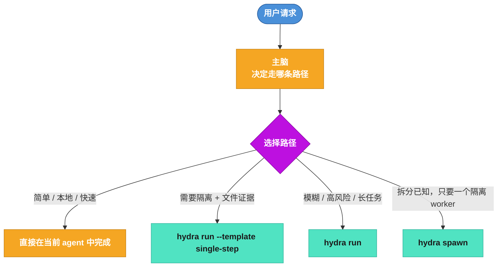
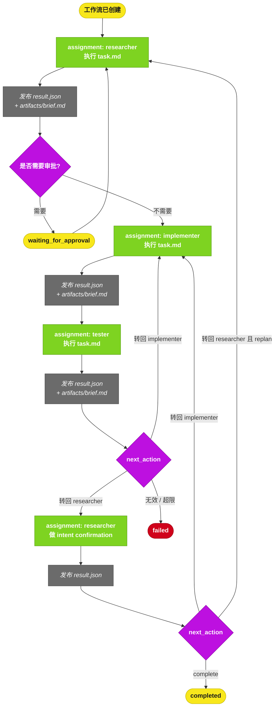
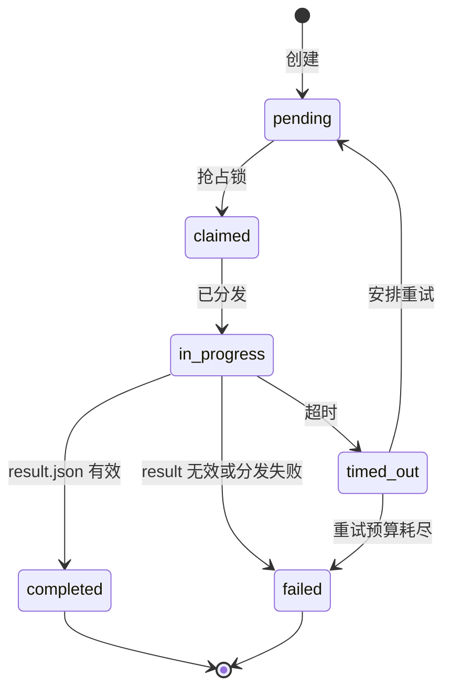
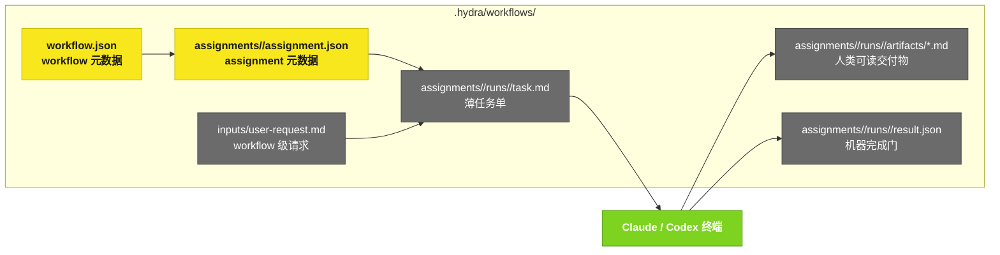

# Hydra 工作流全景图

## 1. 模式选择

## 2. 运行时主流程

## 3. Assignment 状态机

## 4. 文件模型

## 5. 设计规则

- Hydra 不靠解析 Markdown 正文决定下一步。
- `task.md` 给当前 agent 和人读。
- `artifacts/*.md` 是给下游和人看的正式产物。
- `result.json` 是唯一机器完成门。
- retry = 新终端 + 新 run id + 新输出目录。
