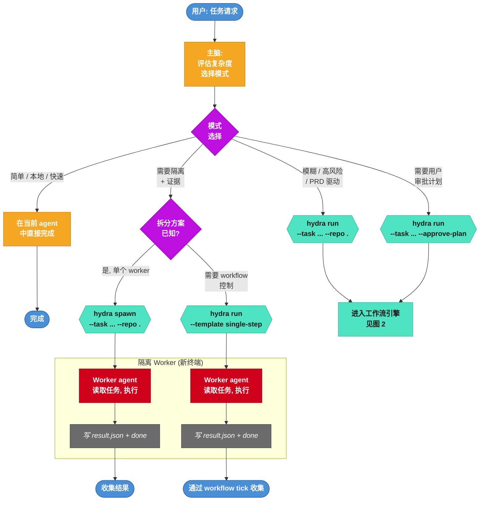
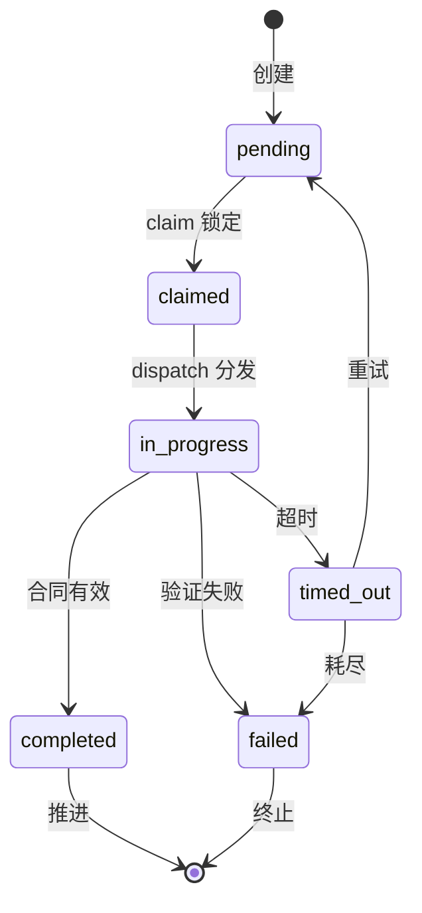
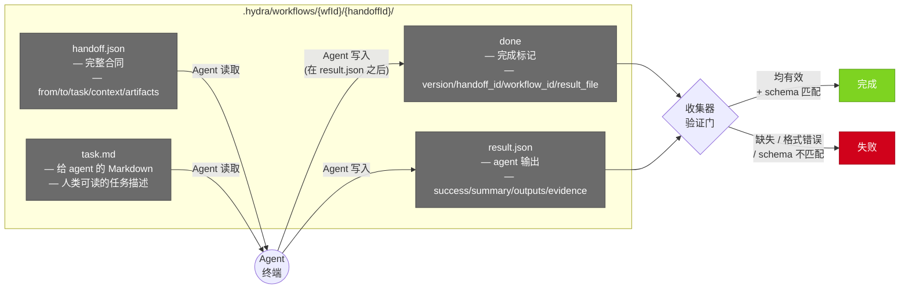
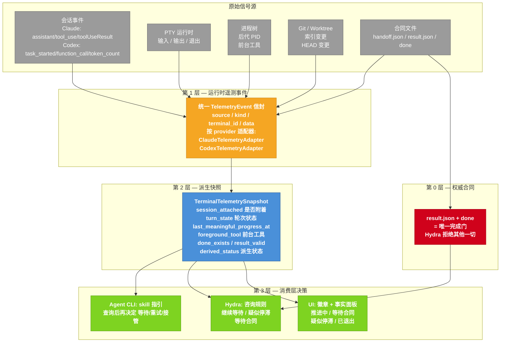
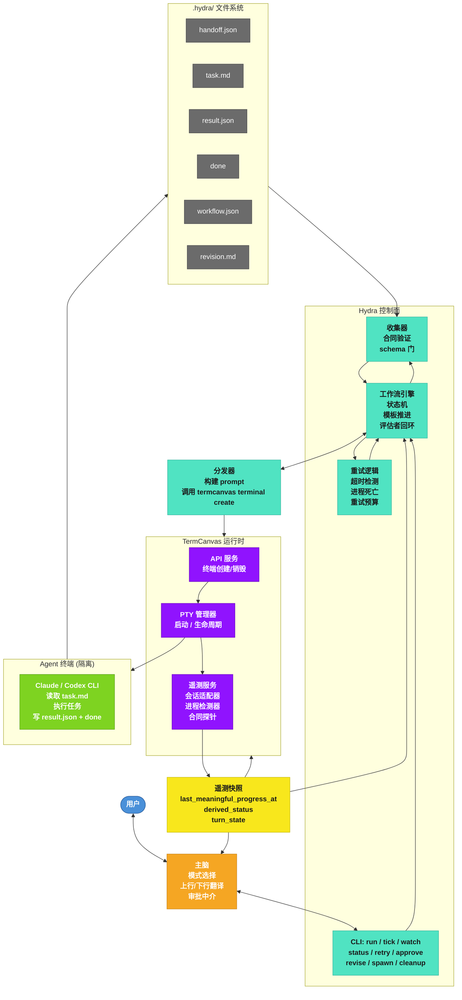

# Hydra 多智能体系统 — 全景流程图

## 1. 模式选择与入口

## 2. 工作流引擎 — 规划者 → 执行者 → 评估者

```mermaid
flowchart TD
    classDef hydra fill:#50e3c2,stroke:#36b49f,color:#1a1a1a,font-weight:bold
    classDef agent fill:#7ed321,stroke:#5a9e18,color:#fff,font-weight:bold
    classDef decision fill:#bd10e0,stroke:#8b0ca6,color:#fff,font-weight:bold
    classDef state fill:#f8e71c,stroke:#c5b800,color:#1a1a1a,font-weight:bold
    classDef file fill:#6b6b6b,stroke:#4a4a4a,color:#fff,font-style:italic
    classDef brain fill:#f5a623,stroke:#c7841a,color:#fff,font-weight:bold
    classDef user fill:#4a90d9,stroke:#2c5f9e,color:#fff,font-weight:bold
    classDef fail fill:#d0021b,stroke:#a00116,color:#fff,font-weight:bold

    START([工作流已创建\n状态: pending]):::state
    START --> DISPATCH_P

    %% ══════════════════════════════════
    %% 规划者阶段
    %% ══════════════════════════════════
    subgraph PLANNER_STAGE ["阶段 0 — 规划者 (Planner)"]
        DISPATCH_P[分发 handoff-0\n到规划者终端]:::hydra
        DISPATCH_P --> P_WORK

        P_WORK[规划者 agent:\n- 调查代码库\n- 列出问题\n- 定义约束\n- 编写实施计划]:::agent

        P_WORK --> P_CONTRACT[写 result.json + done]:::file
    end

    P_CONTRACT --> P_COLLECT

    P_COLLECT[收集器:\n验证 result.json\n+ done 标记]:::hydra
    P_COLLECT --> P_VALID

    P_VALID{合同\n有效?}:::decision
    P_VALID -- "无效" --> P_RETRY_OR_FAIL
    P_VALID -- "有效" --> P_APPROVE_CHECK

    P_RETRY_OR_FAIL{还有\n重试次数?}:::decision
    P_RETRY_OR_FAIL -- "有" --> DISPATCH_P
    P_RETRY_OR_FAIL -- "没有" --> FAILED

    P_APPROVE_CHECK{--approve-plan\n标志?}:::decision
    P_APPROVE_CHECK -- "否 (自动推进)" --> DISPATCH_I
    P_APPROVE_CHECK -- "是" --> WAIT_APPROVAL

    %% ══════════════════════════════════
    %% 计划审批循环 (模式 C)
    %% ══════════════════════════════════
    subgraph APPROVAL_LOOP ["计划审批循环"]
        WAIT_APPROVAL([工作流状态:\nwaiting_for_approval]):::state
        WAIT_APPROVAL --> BRAIN_UP

        BRAIN_UP[主脑:\n读取规划者 result.json\n翻译为用户可理解的摘要]:::brain
        BRAIN_UP --> USER_REVIEW

        USER_REVIEW([用户审阅计划]):::user
        USER_REVIEW --> APPROVE_DECIDE

        APPROVE_DECIDE{用户\n满意?}:::decision
        APPROVE_DECIDE -- "满意" --> APPROVE_CMD
        APPROVE_DECIDE -- "不满意" --> REVISE_LOOP

        REVISE_LOOP[主脑 + 用户对话\n结构化反馈]:::brain
        REVISE_LOOP --> REVISE_CMD

        REVISE_CMD{{hydra revise\n--feedback '...'}}:::hydra
        REVISE_CMD --> REVISE_WRITE

        REVISE_WRITE[写 revision.md\n到规划者包目录\n重置规划者 handoff 为 pending]:::hydra
        REVISE_WRITE --> DISPATCH_P_REVISED

        DISPATCH_P_REVISED[重新分发规划者\n上下文: 上版 result.json\n+ revision.md]:::hydra
        DISPATCH_P_REVISED --> P_WORK_B

        P_WORK_B[新规划者终端:\n读取上版计划 + 反馈\n修订计划]:::agent
        P_WORK_B --> P_CONTRACT_B[写修订后的 result.json + done]:::file
        P_CONTRACT_B --> BRAIN_UP

        APPROVE_CMD{{hydra approve\n--workflow id}}:::hydra
    end

    APPROVE_CMD --> DISPATCH_I

    %% ══════════════════════════════════
    %% 执行者阶段
    %% ══════════════════════════════════
    subgraph IMPLEMENTER_STAGE ["阶段 1 — 执行者 (Implementer)"]
        DISPATCH_I[分发 handoff-1\n到执行者终端]:::hydra
        DISPATCH_I --> I_WORK

        I_WORK[执行者 agent:\n- 读取规划者的计划\n- 实现变更\n- 运行测试\n- 留下证据]:::agent

        I_WORK --> I_CONTRACT[写 result.json + done]:::file
    end

    I_CONTRACT --> I_COLLECT

    I_COLLECT[收集器:\n验证 result.json\n+ done 标记]:::hydra
    I_COLLECT --> I_VALID

    I_VALID{合同\n有效?}:::decision
    I_VALID -- "无效" --> I_RETRY_OR_FAIL
    I_VALID -- "有效" --> DISPATCH_E

    I_RETRY_OR_FAIL{还有\n重试次数?}:::decision
    I_RETRY_OR_FAIL -- "有" --> DISPATCH_I
    I_RETRY_OR_FAIL -- "没有" --> FAILED

    %% ══════════════════════════════════
    %% 评估者阶段
    %% ══════════════════════════════════
    subgraph EVALUATOR_STAGE ["阶段 2 — 评估者 (Evaluator)"]
        DISPATCH_E[分发 handoff-2\n到评估者终端]:::hydra
        DISPATCH_E --> E_WORK

        E_WORK[评估者 agent:\n- 读取计划 + 实现\n- 运行测试套件 + 构建\n- 验证约束\n- 检查回归\n- 标记反模式]:::agent

        E_WORK --> E_CONTRACT[写 result.json + done]:::file
    end

    E_CONTRACT --> E_COLLECT

    E_COLLECT[收集器:\n验证 result.json\n+ done 标记]:::hydra
    E_COLLECT --> E_VALID

    E_VALID{合同\n有效?}:::decision
    E_VALID -- "无效" --> E_RETRY_OR_FAIL
    E_VALID -- "有效" --> E_DECIDE

    E_RETRY_OR_FAIL{还有\n重试次数?}:::decision
    E_RETRY_OR_FAIL -- "有" --> DISPATCH_E
    E_RETRY_OR_FAIL -- "没有" --> FAILED

    %% ══════════════════════════════════
    %% 评估者决策 (回环或完成)
    %% ══════════════════════════════════
    E_DECIDE{评估者\nresult.success?}:::decision
    E_DECIDE -- "true" --> COMPLETED
    E_DECIDE -- "false +\nnext_action:\n交回执行者" --> LOOPBACK
    E_DECIDE -- "false +\n无回环" --> FAILED

    LOOPBACK[重新排队 执行者\n+ 评估者 handoff\n上下文: 评估者反馈\n注入执行者文件]:::hydra
    LOOPBACK --> DISPATCH_I

    %% ══════════════════════════════════
    %% 终态
    %% ══════════════════════════════════
    COMPLETED([工作流: 完成]):::state
    FAILED([工作流: 失败]):::fail
```

## 3. Handoff 生命周期 — 状态机

| 转换 | 触发条件 | 说明 |
|------|----------|------|
| `pending → claimed` | `claimPending()` | tick 获取文件锁，防止竞争 |
| `claimed → in_progress` | `markInProgress()` | 终端已分发，agent 开始工作 |
| `in_progress → completed` | `markCompleted()` | result.json + done 验证通过 |
| `in_progress → timed_out` | `markTimedOut()` | 超时或 PTY 进程死亡 |
| `in_progress → failed` | `markFailed()` | 合同验证错误 |
| `timed_out → pending` | `scheduleRetry()` | 还有重试次数，重新排队 |
| `timed_out → failed` | `scheduleRetry()` | 重试次数耗尽 |

**遥测真相层**观测 `in_progress` 状态的 handoff:
- 会话事件、进程树、合同文件活动、git/worktree 变更
- 派生状态: `progressing` | `awaiting_contract` | `stall_candidate` | `exited`

**收集器**在标记 `completed` 前验证:
- `done` 标记存在、`result.json` 存在
- Schema 匹配 (`hydra/v2`)、`handoff_id` / `workflow_id` 匹配、必填字段齐全

## 4. 文件合同 — 唯一真相来源

## 5. 遥测真相层 — 运行时观测

## 6. 完整系统 — 所有组件拼合

## 图例

| 颜色 | 组件 |
|------|------|
| 蓝色 | 用户 |
| 橙色 | 主脑 (当前 agent) |
| 青绿色 | Hydra 控制面 |
| 紫色 | TermCanvas 运行时 |
| 绿色 | Agent 终端 (Claude/Codex) |
| 灰色 | 文件合同 (.hydra/) |
| 黄色 | 遥测真相层 |
| 红色 | 失败状态 |

## 工作流模式总览

| 模式 | 命令 | 使用场景 |
|------|------|----------|
| **直接执行** | *(不用 hydra)* | 简单、本地、快速 |
| **Spawn** | `hydra spawn` | 拆分方案已知, 单个隔离 worker, 无需工作流 |
| **单步** | `hydra run --template single-step` | 单个执行者 + 隔离 + 重试控制 |
| **完整工作流** | `hydra run` | 模糊 / 高风险 / PRD 驱动 |
| **审批计划** | `hydra run --approve-plan` | 用户需要在执行前审阅/修订计划 |

## 状态总览

| 层级 | 状态 | 转换触发 |
|------|------|----------|
| **Handoff** | pending → claimed → in_progress → completed / timed_out / failed | 文件锁 + 收集器验证 |
| **Workflow** | pending → running → waiting_for_approval → completed / failed | 模板推进逻辑 |
| **遥测** | starting → progressing → awaiting_contract → stall_candidate → exited | 运行时信号派生 |
