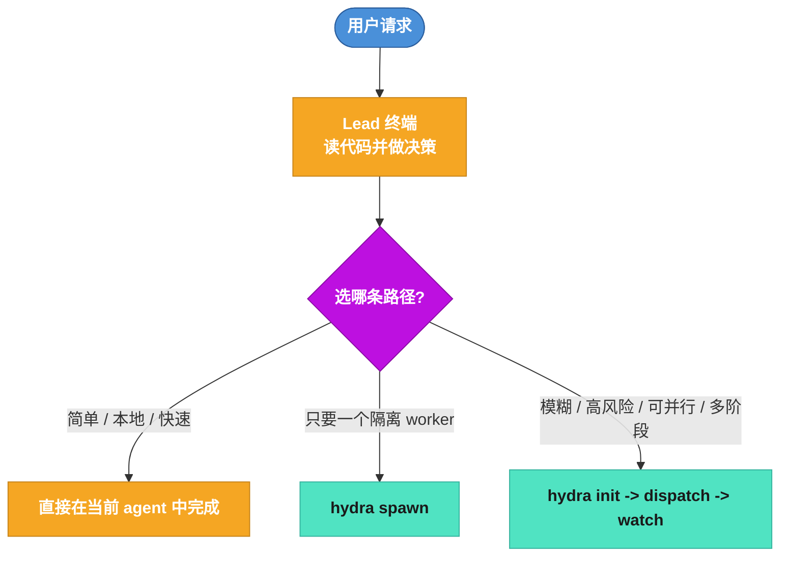
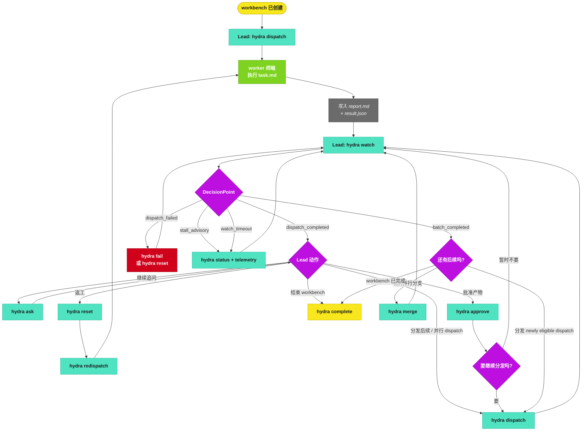
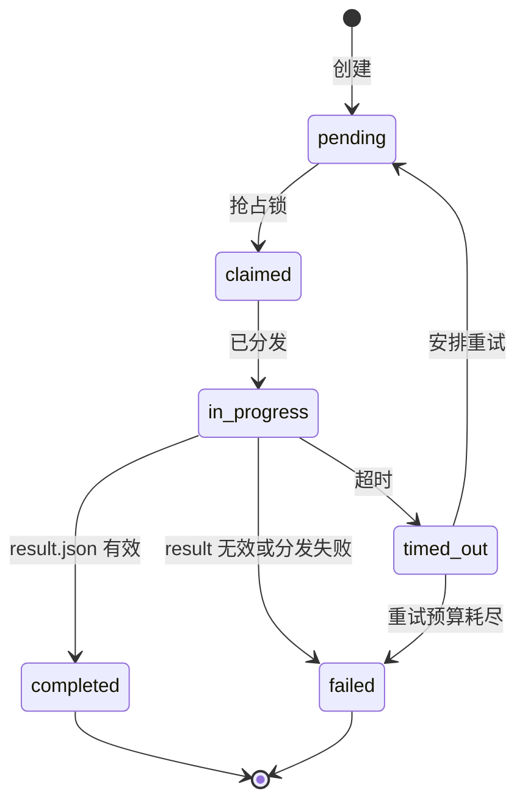
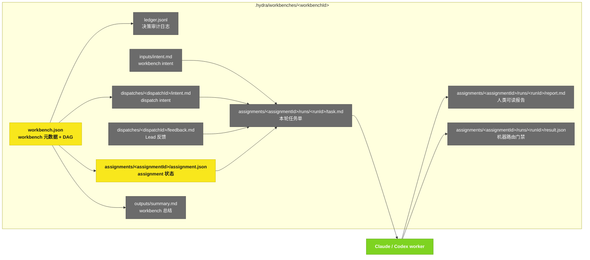

# Hydra Workbench 全景图

## 1. 模式选择

## 2. 运行时主流程

## 3. Assignment 状态机

## 4. 文件模型

## 5. 设计规则

- `hydra watch` 是 Lead 的决策循环。
- `report.md` 负责解释发生了什么；`result.json` 负责告诉 Hydra 怎么路由。
- Role 文件锁定 dispatch 的 CLI / model / reasoning 配置。
- `hydra ask` 是轻量追问；`hydra reset` 是明确返工。
- retry = 新 run id + 新输出目录。
- `stall_advisory` 不是失败——它是 liveness 探针在提示"worker 还活着但没推进"。Lead 自行决定：继续等 / reset / 人肉接手。
