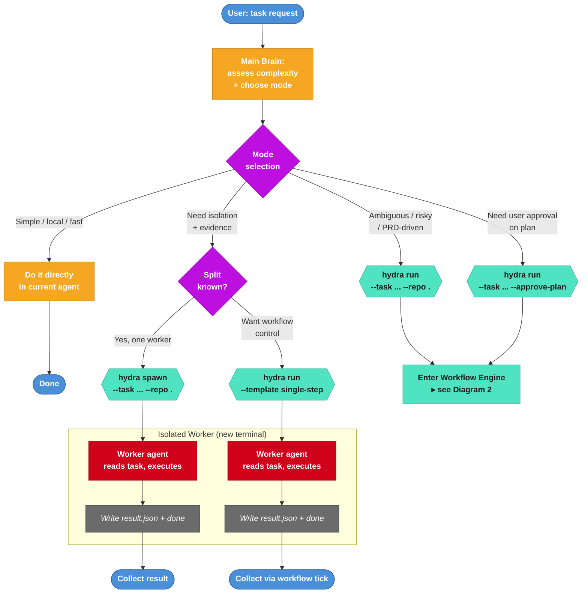
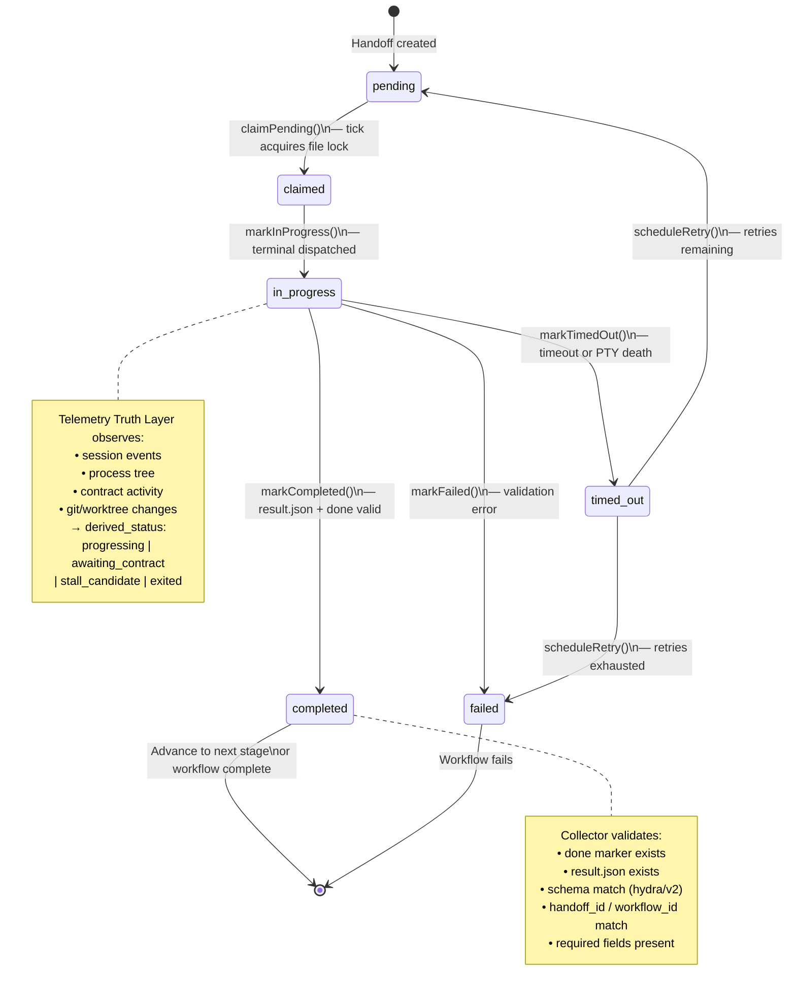
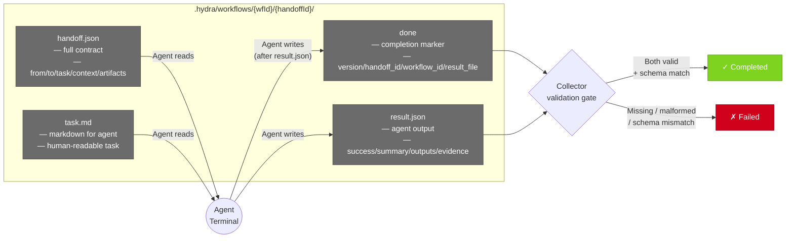
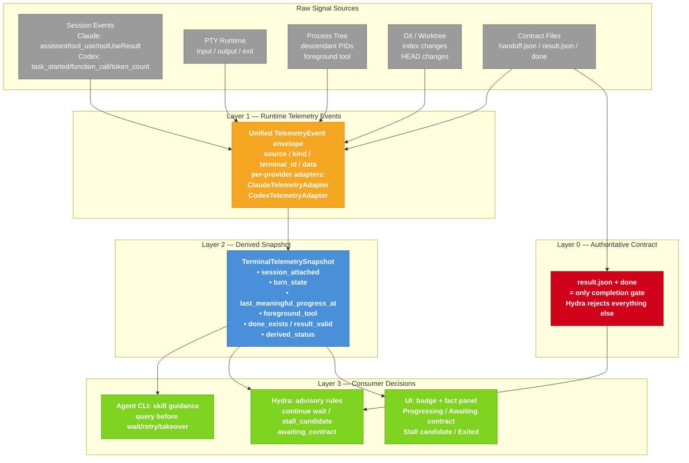
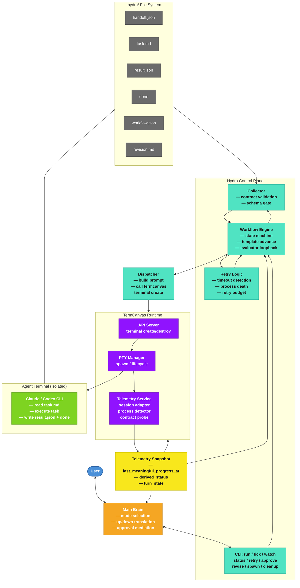

# Hydra Multi-Agent System — Panoramic Flowchart

## 1. Mode Selection & Entry Points

## 2. Workflow Engine — Planner → Implementer → Evaluator

```mermaid
flowchart TD
    classDef hydra fill:#50e3c2,stroke:#36b49f,color:#1a1a1a,font-weight:bold
    classDef agent fill:#7ed321,stroke:#5a9e18,color:#fff,font-weight:bold
    classDef decision fill:#bd10e0,stroke:#8b0ca6,color:#fff,font-weight:bold
    classDef state fill:#f8e71c,stroke:#c5b800,color:#1a1a1a,font-weight:bold
    classDef file fill:#6b6b6b,stroke:#4a4a4a,color:#fff,font-style:italic
    classDef brain fill:#f5a623,stroke:#c7841a,color:#fff,font-weight:bold
    classDef user fill:#4a90d9,stroke:#2c5f9e,color:#fff,font-weight:bold
    classDef fail fill:#d0021b,stroke:#a00116,color:#fff,font-weight:bold

    START([Workflow created\nstatus: pending]):::state
    START --> DISPATCH_P

    %% ══════════════════════════════════
    %% PLANNER STAGE
    %% ══════════════════════════════════
    subgraph PLANNER_STAGE ["Stage 0 — Planner"]
        DISPATCH_P[Dispatch handoff-0\nto Planner terminal]:::hydra
        DISPATCH_P --> P_WORK

        P_WORK[Planner agent:\n• investigate codebase\n• list problems\n• define constraints\n• write implementation plan]:::agent

        P_WORK --> P_CONTRACT[Write result.json + done]:::file
    end

    P_CONTRACT --> P_COLLECT

    P_COLLECT[Collector:\nvalidate result.json\n+ done marker]:::hydra
    P_COLLECT --> P_VALID

    P_VALID{Contract\nvalid?}:::decision
    P_VALID -- "Invalid" --> P_RETRY_OR_FAIL
    P_VALID -- "Valid" --> P_APPROVE_CHECK

    P_RETRY_OR_FAIL{Retries\nleft?}:::decision
    P_RETRY_OR_FAIL -- "Yes" --> DISPATCH_P
    P_RETRY_OR_FAIL -- "No" --> FAILED

    P_APPROVE_CHECK{--approve-plan\nflag?}:::decision
    P_APPROVE_CHECK -- "No (auto)" --> DISPATCH_I
    P_APPROVE_CHECK -- "Yes" --> WAIT_APPROVAL

    %% ══════════════════════════════════
    %% PLAN APPROVAL LOOP (Mode C)
    %% ══════════════════════════════════
    subgraph APPROVAL_LOOP ["Plan Approval Loop"]
        WAIT_APPROVAL([Workflow status:\nwaiting_for_approval]):::state
        WAIT_APPROVAL --> BRAIN_UP

        BRAIN_UP[Main Brain:\nread planner result.json\ntranslate → user summary]:::brain
        BRAIN_UP --> USER_REVIEW

        USER_REVIEW([User reviews plan]):::user
        USER_REVIEW --> APPROVE_DECIDE

        APPROVE_DECIDE{User\nsatisfied?}:::decision
        APPROVE_DECIDE -- "Yes" --> APPROVE_CMD
        APPROVE_DECIDE -- "No" --> REVISE_LOOP

        REVISE_LOOP[Main Brain ↔ User dialogue\nstructure feedback]:::brain
        REVISE_LOOP --> REVISE_CMD

        REVISE_CMD{{hydra revise\n--feedback '...'}}:::hydra
        REVISE_CMD --> REVISE_WRITE

        REVISE_WRITE[Write revision.md\nto planner package\nreset planner handoff → pending]:::hydra
        REVISE_WRITE --> DISPATCH_P_REVISED

        DISPATCH_P_REVISED[Re-dispatch Planner\ncontext: prev result.json\n+ revision.md]:::hydra
        DISPATCH_P_REVISED --> P_WORK_B

        P_WORK_B[New Planner terminal:\nread prev plan + feedback\nrevise plan]:::agent
        P_WORK_B --> P_CONTRACT_B[Write revised result.json + done]:::file
        P_CONTRACT_B --> BRAIN_UP

        APPROVE_CMD{{hydra approve\n--workflow id}}:::hydra
    end

    APPROVE_CMD --> DISPATCH_I

    %% ══════════════════════════════════
    %% IMPLEMENTER STAGE
    %% ══════════════════════════════════
    subgraph IMPLEMENTER_STAGE ["Stage 1 — Implementer"]
        DISPATCH_I[Dispatch handoff-1\nto Implementer terminal]:::hydra
        DISPATCH_I --> I_WORK

        I_WORK[Implementer agent:\n• read planner's plan\n• implement changes\n• run tests\n• leave evidence]:::agent

        I_WORK --> I_CONTRACT[Write result.json + done]:::file
    end

    I_CONTRACT --> I_COLLECT

    I_COLLECT[Collector:\nvalidate result.json\n+ done marker]:::hydra
    I_COLLECT --> I_VALID

    I_VALID{Contract\nvalid?}:::decision
    I_VALID -- "Invalid" --> I_RETRY_OR_FAIL
    I_VALID -- "Valid" --> DISPATCH_E

    I_RETRY_OR_FAIL{Retries\nleft?}:::decision
    I_RETRY_OR_FAIL -- "Yes" --> DISPATCH_I
    I_RETRY_OR_FAIL -- "No" --> FAILED

    %% ══════════════════════════════════
    %% EVALUATOR STAGE
    %% ══════════════════════════════════
    subgraph EVALUATOR_STAGE ["Stage 2 — Evaluator"]
        DISPATCH_E[Dispatch handoff-2\nto Evaluator terminal]:::hydra
        DISPATCH_E --> E_WORK

        E_WORK[Evaluator agent:\n• read plan + implementation\n• run test suite + build\n• verify constraints\n• check for regressions\n• flag anti-patterns]:::agent

        E_WORK --> E_CONTRACT[Write result.json + done]:::file
    end

    E_CONTRACT --> E_COLLECT

    E_COLLECT[Collector:\nvalidate result.json\n+ done marker]:::hydra
    E_COLLECT --> E_VALID

    E_VALID{Contract\nvalid?}:::decision
    E_VALID -- "Invalid" --> E_RETRY_OR_FAIL
    E_VALID -- "Valid" --> E_DECIDE

    E_RETRY_OR_FAIL{Retries\nleft?}:::decision
    E_RETRY_OR_FAIL -- "Yes" --> DISPATCH_E
    E_RETRY_OR_FAIL -- "No" --> FAILED

    %% ══════════════════════════════════
    %% EVALUATOR DECISION (Loop or Complete)
    %% ══════════════════════════════════
    E_DECIDE{Evaluator\nresult.success?}:::decision
    E_DECIDE -- "true" --> COMPLETED
    E_DECIDE -- "false +\nnext_action:\nhandoff to\nimplementer" --> LOOPBACK
    E_DECIDE -- "false +\nno loopback" --> FAILED

    LOOPBACK[Requeue implementer\n+ evaluator handoffs\nContext: evaluator feedback\nadded to implementer files]:::hydra
    LOOPBACK --> DISPATCH_I

    %% ══════════════════════════════════
    %% TERMINAL STATES
    %% ══════════════════════════════════
    COMPLETED([Workflow: completed ✓]):::state
    FAILED([Workflow: failed ✗]):::fail
```

## 3. Handoff Lifecycle — State Machine

## 4. File Contract — The Only Source of Truth

## 5. Telemetry Truth Layer — Runtime Observation

## 6. Complete System — All Pieces Together

## Legend

| Color | Component |
|-------|-----------|
| 🔵 Blue | User |
| 🟠 Orange | Main Brain (current agent) |
| 🟢 Green (teal) | Hydra Control Plane |
| 🟣 Purple | TermCanvas Runtime |
| 🟢 Green | Agent Terminal (Claude/Codex) |
| ⬛ Gray | File Contract (.hydra/) |
| 🟡 Yellow | Telemetry Truth Layer |
| 🔴 Red | Failure states |

## Workflow Mode Summary

| Mode | Command | When to use |
|------|---------|-------------|
| **Direct** | *(no hydra)* | Simple, local, fast |
| **Spawn** | `hydra spawn` | Known split, one isolated worker, no workflow |
| **Single-Step** | `hydra run --template single-step` | One implementer + isolation + retry control |
| **Full Workflow** | `hydra run` | Ambiguous / risky / PRD-driven |
| **Approve-Plan** | `hydra run --approve-plan` | User wants to review/revise plan before execution |

## State Summary

| Layer | States | Transition Trigger |
|-------|--------|--------------------|
| **Handoff** | pending → claimed → in_progress → completed / timed_out / failed | File lock + collector validation |
| **Workflow** | pending → running → waiting_for_approval → completed / failed | Template advance logic |
| **Telemetry** | starting → progressing → awaiting_contract → stall_candidate → exited | Derived from runtime signals |
