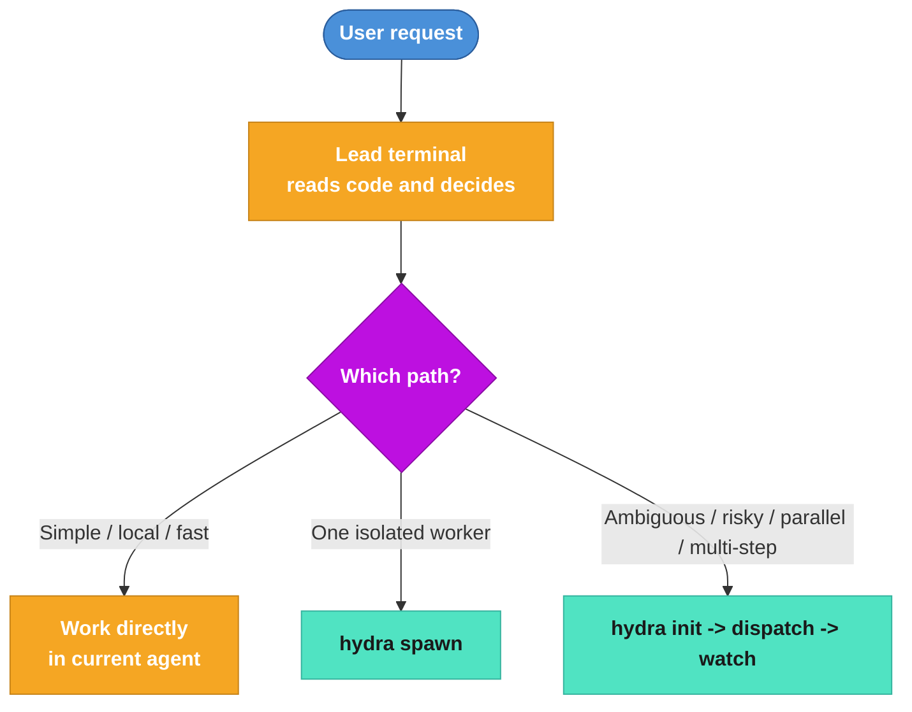
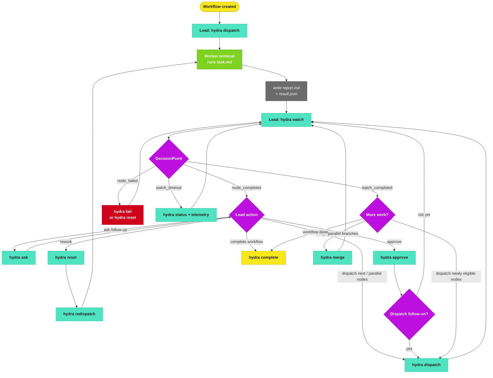
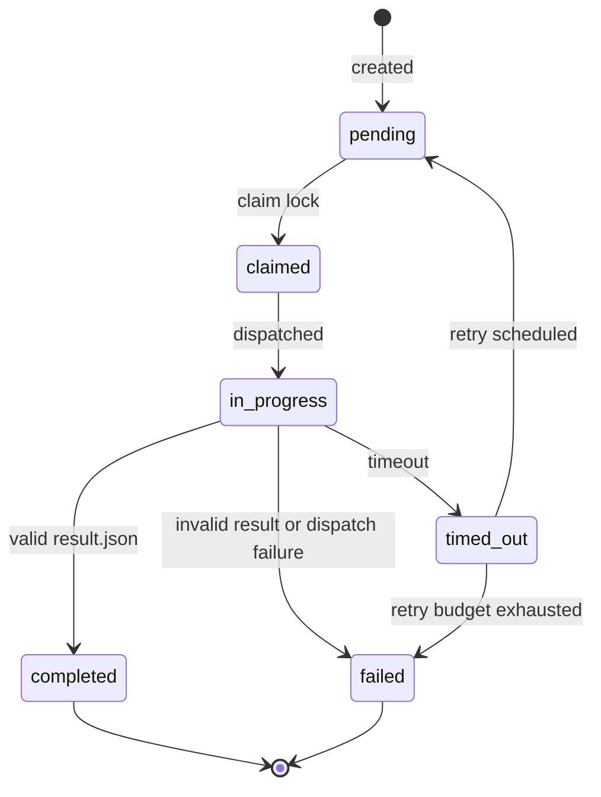
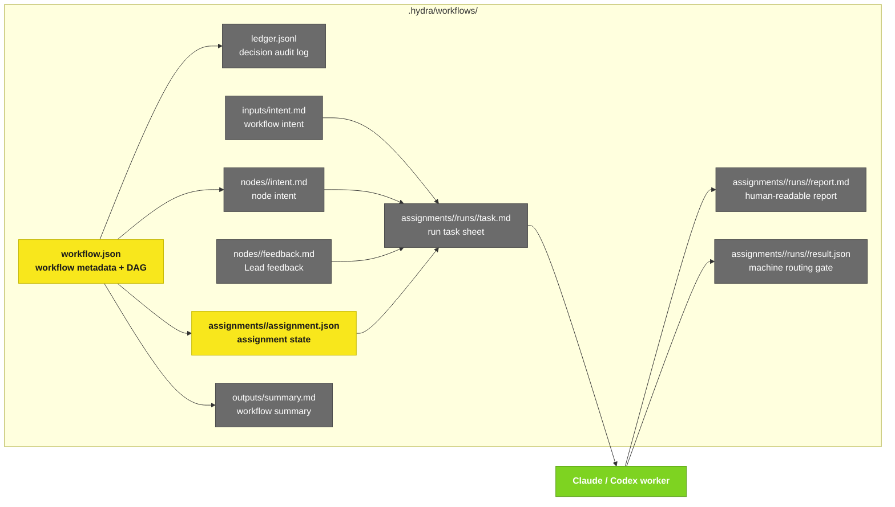

# Hydra Workflow Panorama

## 1. Mode Selection

## 2. Runtime Control Flow

## 3. Assignment State Machine

## 4. File Model

## 5. Design Rules

- `hydra watch` is the Lead's decision loop.
- `report.md` explains what happened; `result.json` tells Hydra how to route.
- Role files lock the CLI / model / reasoning profile for a node.
- `hydra ask` is lightweight follow-up; `hydra reset` is explicit rework.
- Retry means a new run id and a new output directory.
