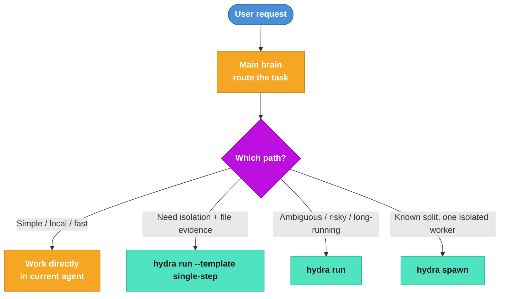
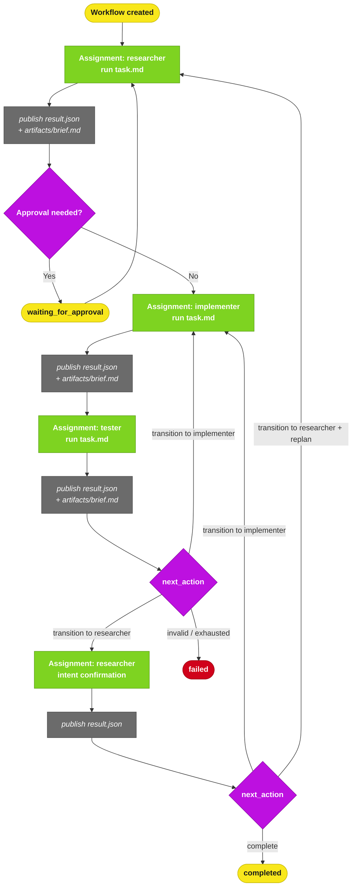
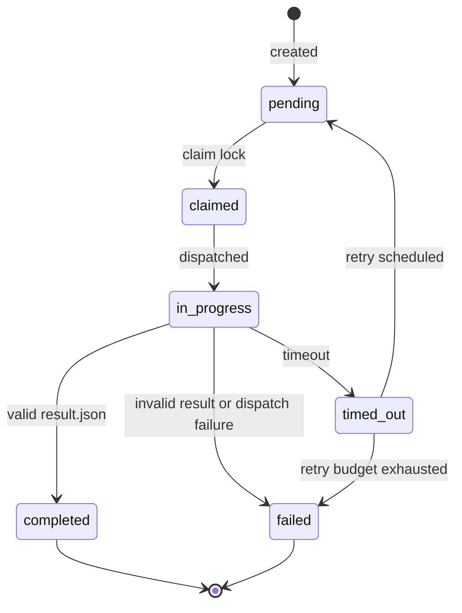
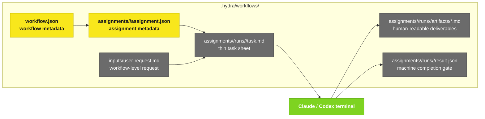

# Hydra Workflow Panorama

## 1. Mode Selection

## 2. Runtime Control Flow

## 3. Assignment State Machine

## 4. File Model

## 5. Design Rules

- Hydra does not read Markdown prose to decide the next step.
- `task.md` is for the current agent and humans.
- `artifacts/*.md` are downstream deliverables.
- `result.json` is the only machine completion gate.
- Retry means a new terminal, a new run id, and a new output directory.
